
# **Project 3:  Autostitch**

**Naman Makkar (nbm49)**

## Spherical Warp

We can observe the warped images below - 

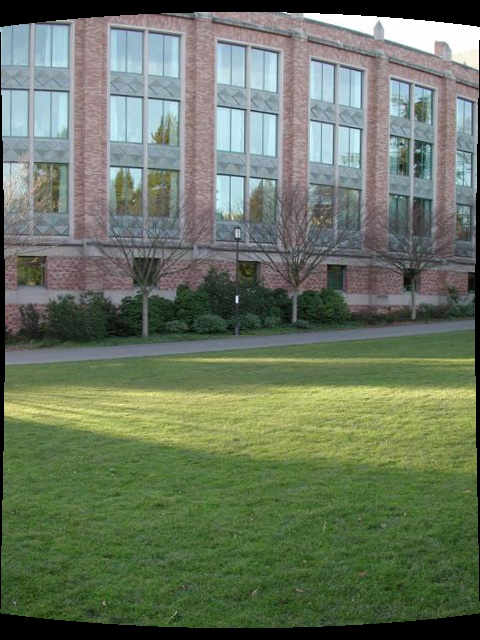
 
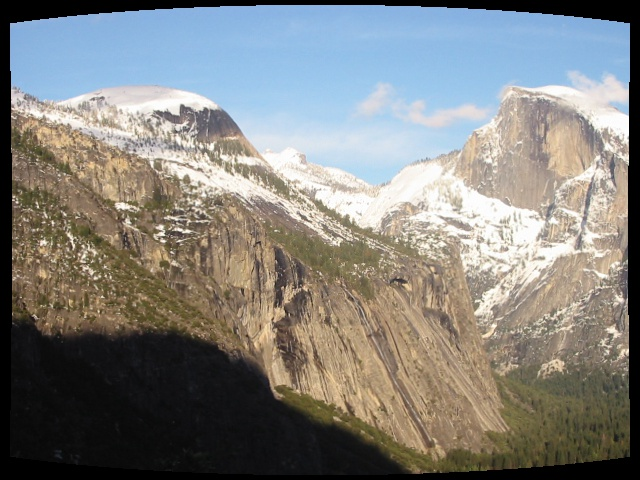

## Align Images

The functionality of the Align Images can be oberved below -

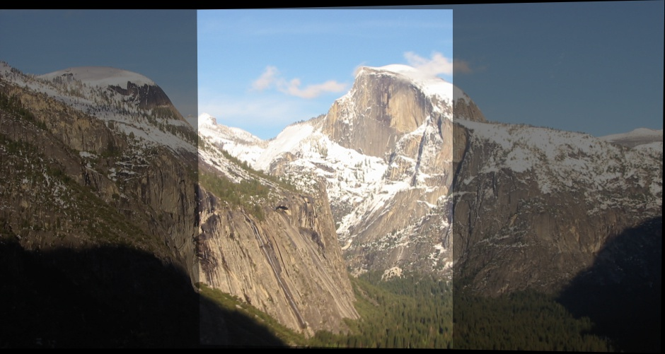
 
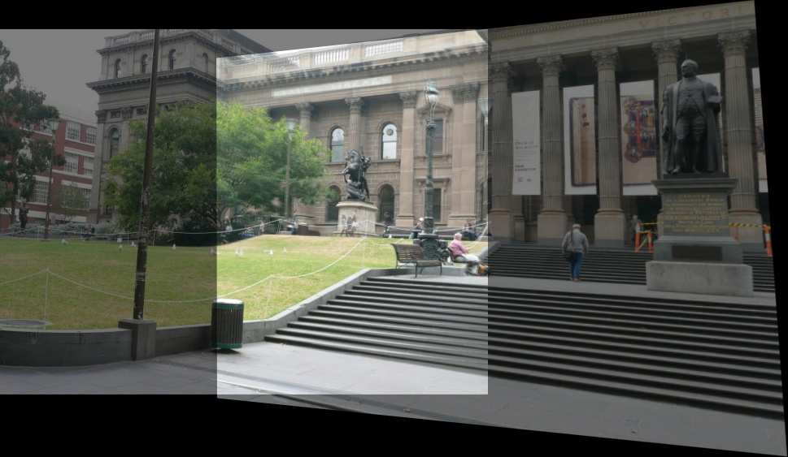
 
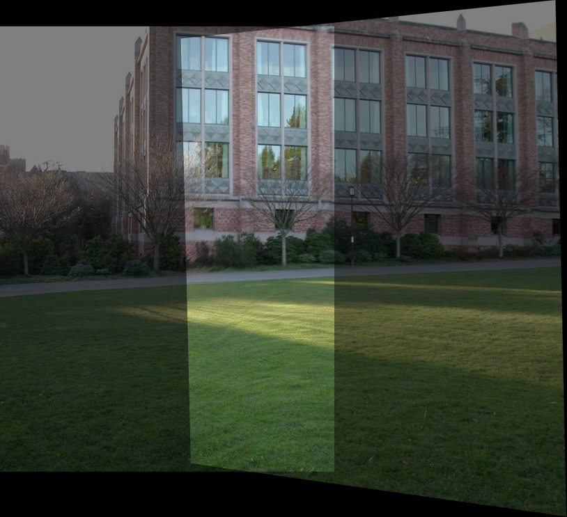

## Panorama 

The functionality of Panorama can be observed below - 
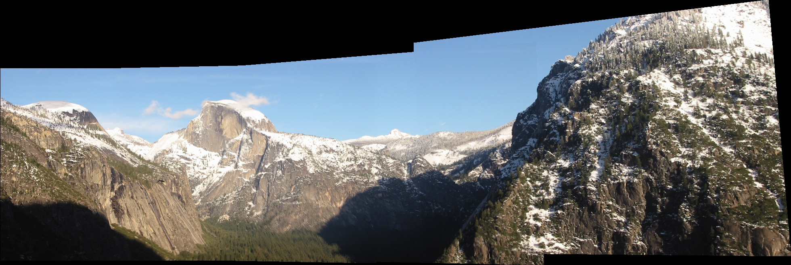
 
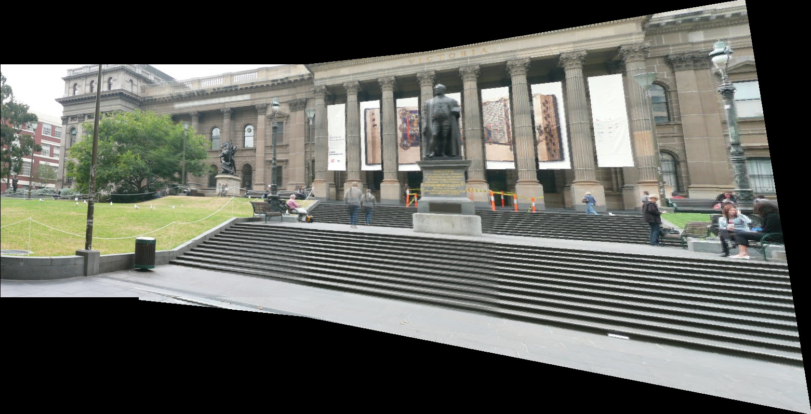
 
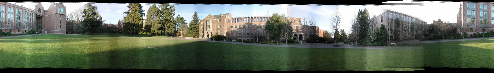
 
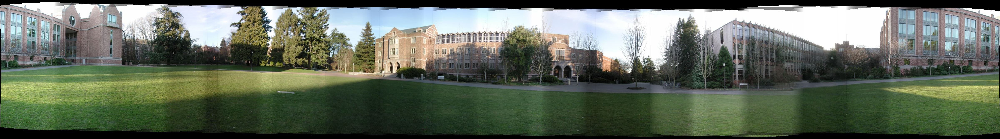

## Artifact
Camera Used - iPhone-13, Focal Length = 5.1mm, CCD width = 9.69mm, Image Width = 4032 pixels. Therefore, the focal length in pixels is calculated as 4032*5.1/9.69 = 2122.1 pixels

## Extra Credit

Gaussian Blending was implemented in the file **blend.py**, the results of Gaussian Blending can be observed below - 

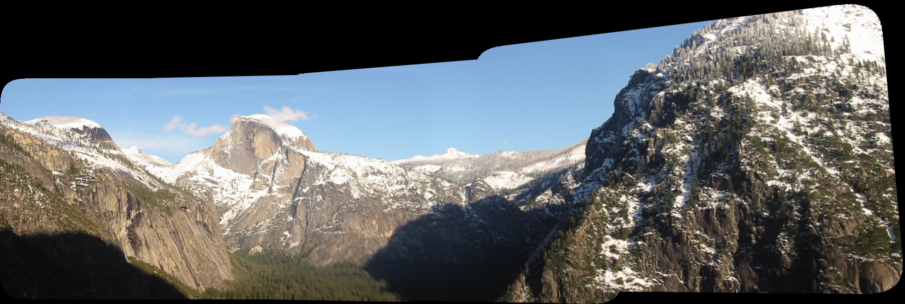
 
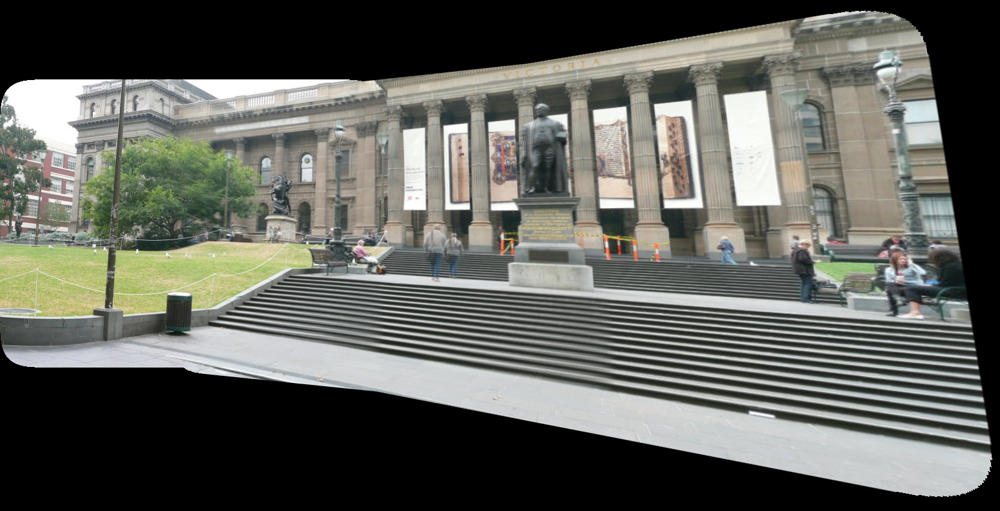
 
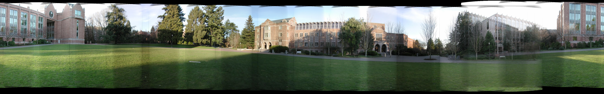
 
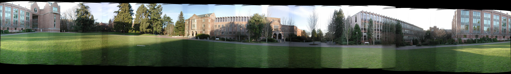